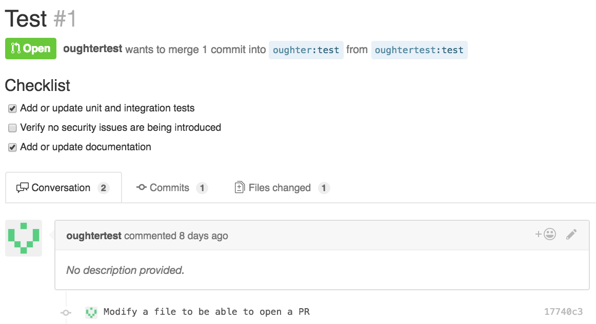
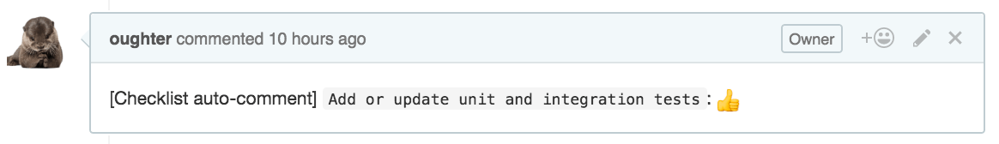
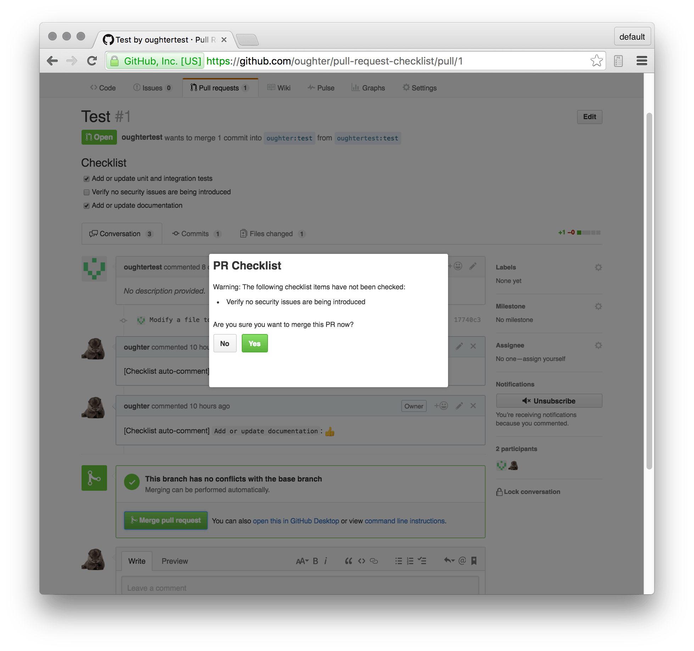

# Pull Request Checklist

A browser extension that inserts a checklist on GitHub pull requests and prompts users if a merge is initiated when not all checklist items are checked.

The idea behind the extension is to place a team's key concerns for codebase updates, such as tests, performance, etc., in front of users who open and review pull requests.

The extension tracks the checking off of those items via PR comments and prompts a user who initiates a merge if not all items are checked, but the user is not prevented from merging by the extension regardless of the checklist state -- the prompt is a warning that the user can choose to proceed past.


## Screenshots

### Checklist on PR page



### Comment automatically added after checking an item


### Prompt when initiating a merge of a PR with unchecked items



## Local Dev Setup

```bash
$ npm install
$ npm run build
```
